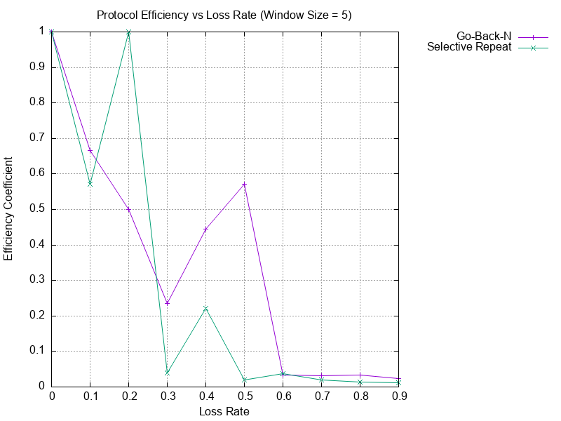
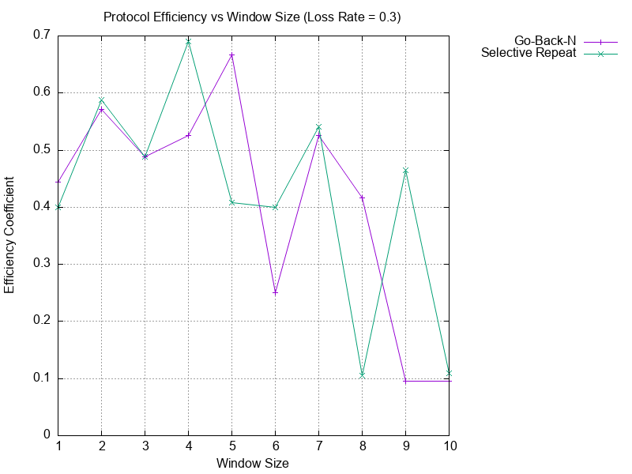

<div style="text-align: center;">

**Санкт-Петербургский Политехнический Университет Петра Великого**  
**Физико-Механический институт**  
**Высшая школа прикладной математики и вычислительной физики**

<br><br><br><br>

# Отчет по лабораторной работе: Протоколы Go-Back-N и Selective Repeat

<br><br>

</div>

<div style="text-align: right; margin-right: 50px;">

**Выполнил:**  
студент гр. 5040102/40201  
**Стрижкин Д.А.**

<br>

**Проверил:**  
доцент  
**Баженов А.Н.**

</div>

<br><br><br><br><br><br><br><br>
<br><br><br><br><br><br><br><br>
<br><br>

<div style="text-align: center;">

**Санкт-Петербург — 2026**

</div>

<div style="page-break-after: always;"></div>

## 1. Введение

Целью данной лабораторной работы является изучение и сравнительный анализ двух основных алгоритмов автоматического запроса повторной передачи (ARQ), используемых для обеспечения надежной доставки данных в сетях с потерями: **Go-Back-N (GBN)** и **Selective Repeat (SR)**.

Исходный код проекта доступен в репозитории: [denisstrizhkin/network-labs](https://github.com/denisstrizhkin/network-labs)

В ходе работы необходимо:

1. Реализовать протокол Selective Repeat на языке программирования Rust, опираясь на существующую реализацию Go-Back-N.

2. Организовать симуляцию ненадежного канала связи с возможностью настройки вероятности потери пакетов.

3. Провести серию экспериментов для сравнения эффективности обоих протоколов при различных параметрах сети.

4. Проанализировать полученные результаты и сделать выводы о применимости каждого из протоколов.

---

## 2. Теоретические сведения

Задача обеспечения надежной передачи данных поверх ненадежного канала решается с помощью механизмов подтверждения (ACK) и тайм-аутов.

### 2.1. Go-Back-N (Возврат на N)
В протоколе GBN отправитель может передавать несколько пакетов (в пределах окна размера N) без ожидания подтверждения. Получатель принимает пакеты **строго по порядку**.

1. **Принцип работы**: Если пакет теряется или приходит с ошибкой, получатель отбрасывает его и все последующие пакеты (даже если они пришли корректно), отправляя повторные подтверждения (Cumulative ACK) для последнего верно принятого пакета.

2. **Реакция на ошибку**: По истечении тайм-аута отправитель вынужден повторно передать **весь** набор пакетов, начиная с потерянного, что создает значительную нагрузку на сеть при высоком уровне ошибок.

### 2.2. Selective Repeat (Выборочный повтор)
SR устраняет основной недостаток GBN — избыточную повторную передачу корректно принятых пакетов.

1. **Принцип работы**: Получатель буферизирует пакеты, пришедшие не по порядку, если   они попадают в приемное окно. Каждому пакету соответствует индивидуальный таймер на стороне отправителя.

2. **Реакция на ошибку**: Подтверждаются отдельные пакеты (Selective ACK). По истечении тайм-аута для конкретного пакета, повторно передается **только этот пакет**.

---

## 3. Описание реализации

Реализация выполнена на языке **Rust**. Проект включает в себя модули для отправителя (`Sender`), получателя (`Reader`) и симулятору потерь (`simulate_loss`).

### 3.1. Структуры данных
Основной единицей передачи является структура `Packet`:
```rust
pub struct Packet {
    number: AckNumber,      // Порядковый номер
    data: [u8; DATA_SIZE],  // Полезная нагрузка
    size: u8,               // Размер данных
    state: PacketState,     // Флаги (Начало/Конец передачи)
}
```

### 3.2. Особенности реализации Selective Repeat
В отличие от GBN, в реализацию SR были внесены следующие ключевые изменения:

1.  **Буферизация на стороне Получателя**:
    Использована структура `BTreeMap<AckNumber, Packet>` для хранения пакетов, пришедших вне очереди. Это позволяет эффективно вставлять и извлекать данные по их порядковому номеру.
    ```rust
    // Если получен пакет, не являющийся следующим ожидаемым, сохраняем его в буфер
    if !self.buffer.contains_key(&number) {
        self.buffer.insert(number, packet);
    }
    ```

2.  **Логика Отправителя**:
    Очередь отправки содержит не просто пакеты, а структуры с метаданными, отслеживающие статус подтверждения (`is_acked`) и время последней отправки (`last_sent`) для каждого пакета индивидуально.
    ```rust
    struct SenderPacket {
        packet: Packet,
        is_acked: bool,
        last_sent: Option<Instant>,
    }
    ```
    В цикле отправки проверяется каждый пакет в окне, и если его тайм-аут истек, производится повторная отправка только этого пакета.

---

## 4. Результаты экспериментов

Для оценки производительности производилось измерение **коэффициента эффективности** (η), который рассчитывается как:
> **η = Общее количество пакетов / Фактически отправленные пакеты**

Идеальное значение **η = 1** (потерь нет, повторов нет).

### 4.1. Зависимость эффективности от вероятности потерь
*Параметры эксперимента*: Размер окна фиксирован и равен **5**. Вероятность потери варьируется от 0 до 0.9.



**Анализ**:

1. При нулевых потерях оба протокола имеют η = 1.

2. С ростом вероятности потерь эффективность GBN падает стремительно. При потерях 50% GBN практически перестает передавать полезные данные из-за постоянных сбросов окна.

3. Selective Repeat демонстрирует линейное снижение эффективности, пропорциональное уровню потерь (η ≈ 1 - Ploss), так как пересылаются только потерянные пакеты. При высоких потерях (>60%) преимущество SR становится подавляющим.

### 4.2. Зависимость эффективности от размера окна
*Параметры эксперимента*: Вероятность потери фиксирована и равна **0.3** (30%). Размер окна варьируется от 1 до 10.



**Анализ**:

1. Для GBN увеличение размера окна при наличии потерь может негативно сказываться на эффективности, так как цена ошибки возрастает (нужно пересылать больше пакетов при единичной потере).

2. Для SR увеличение размера окна позволяет лучше утилизировать пропускную способность канала, не сильно влияя на коэффициент эффективности (overheads на повторную передачу постоянны для каждого пакета).

---

## 5. Выводы

В ходе лабораторной работы была успешно реализована и протестирована модификация протокола ARQ — Selective Repeat.

Сравнительный анализ показал:

1. **Selective Repeat** является значительно более эффективным протоколом в средах с высоким уровнем помех и потерь пакетов. Сложность его реализации (необходимость буферизации и логики таймеров) оправдывается выигрышем в пропускной способности.

2. **Go-Back-N** пригоден для использования в надежных сетях с низкой вероятностью ошибок, где простота реализации получателя (отсутствие буфера) является преимуществом.

3. Разработанная программа корректно обрабатывает потери данных, обеспечивая целостность передаваемого сообщения, что подтверждено прохождением тестов.
