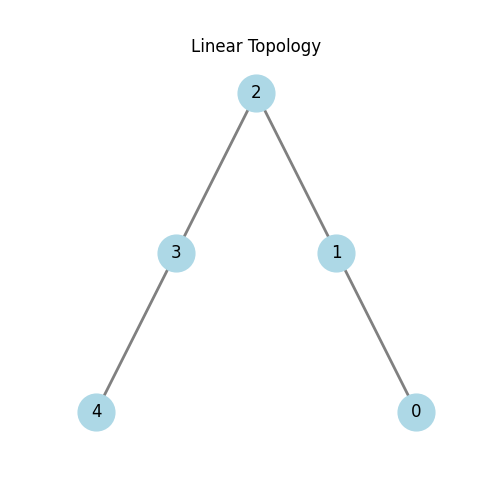
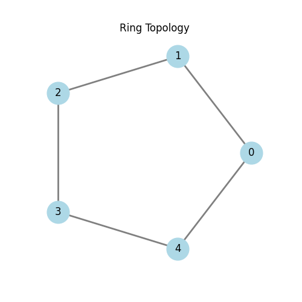
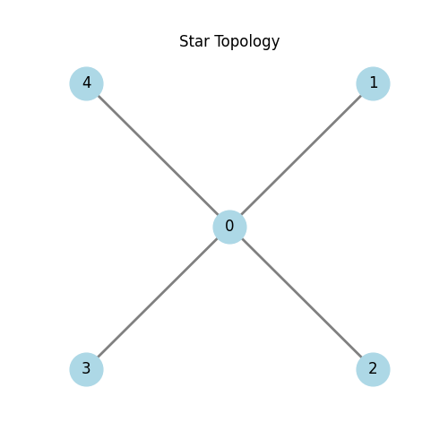

<div style="text-align: center;">

**Санкт-Петербургский Политехнический Университет Петра Великого**  
**Физико-Механический институт**  
**Высшая школа прикладной математики и вычислительной физики**

<br><br><br><br>

# Отчет по лабораторной работе: Алгоритмы маршрутизации (OSPF)

<br><br>

</div>

<div style="text-align: right; margin-right: 50px;">

**Выполнил:**  
студент гр. 5040102/40201  
**Стрижкин Д.А.**

<br>

**Проверил:**  
доцент  
**Баженов А.Н.**

</div>

<br><br><br><br><br><br><br><br>
<br><br><br><br><br><br><br><br>
<br><br>

<div style="text-align: center;">

**Санкт-Петербург — 2026**

</div>

<div style="page-break-after: always;"></div>

## 1. Введение

В данной лабораторной работе исследуется работа протокола динамической маршрутизации с использованием алгоритма состояния каналов (Link State) и алгоритма Дейкстры для поиска кратчайших путей. Моделирование проводится на языке Rust, где каждый маршрутизатор представлен отдельным потоком, обменивающимся сообщениями с соседями.

Цель работы:
1. Реализовать алгоритм рассылки объявлений о состоянии каналов (LSA).
2. Реализовать алгоритм Дейкстры для построения таблицы маршрутизации.
3. Проверить работу алгоритма на различных топологиях сети.

## 2. Линейная топология

Топология представляет собой цепочку узлов: 0-1-2-3-4.



**Тест:** отправка сообщения от узла 0 к узлу 4.

**Результаты моделирования:**

```
=== Running Simulation: Linear Topology ===
--- Sending Message from 0 to 4 ---
[Router 4] received message from 0: [0, 1, 2, 3, 4]
```

Сообщение прошло последовательно через все узлы сети.

## 3. Кольцевая топология

Топология представляет собой замкнутое кольцо: 0-1-2-3-4-0.



**Тест:** отправка сообщения от узла 0 к узлу 2.
В данной сети сообщение может пройти либо по пути 0->1->2 (стоимость 2), либо 0->4->3->2 (стоимость 3). Алгоритм должен выбрать путь с наименьшей стоимостью.

**Результаты моделирования:**

```
=== Running Simulation: Ring Topology ===
--- Sending Message from 0 to 2 ---
[Router 2] received message from 0: [0, 1, 2]
```

Маршрутизатор успешно выбрал кратчайший путь.

## 4. Топология "Звезда"

В данной топологии центральный узел 0 соединен со всеми остальными узлами (1, 2, 3, 4). Прямой связи между периферийными узлами нет.



**Тест:** отправка сообщения от узла 4 к узлу 3.

**Результаты моделирования:**

```
=== Running Simulation: Star Topology ===
--- Sending Message from 4 to 3 ---
[Router 3] received message from 4: [4, 0, 3]
```

Сообщение было передано через центральный узел 0.

## 5. Заключение

В ходе выполнения лабораторной работы была разработана программа на языке Rust, моделирующая работу протокола OSPF. Маршрутизаторы корректно обмениваются информацией о соседях, строят карту сети (топологию) и вычисляют кратчайшие пути с помощью алгоритма Дейкстры. Проведенные тесты на линейной, кольцевой и звездообразной топологиях подтвердили корректность работы реализованных алгоритмов.
